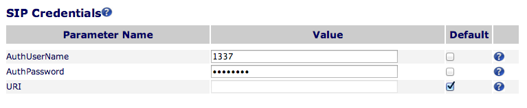
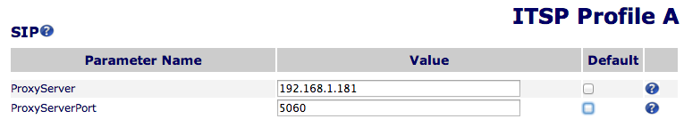
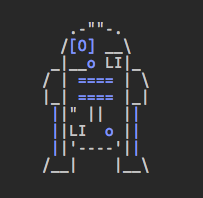

I got [this R2D2 telephone](http://amzn.to/2aU3cuu) as a gift when I was in 6th grade(-ish). I used it in my room as a real telephone as a teenager, even though the handset was the most uncomfortable and least ergonomic handset imaginable. The ringer is the iconic R2D2 noise which will never stop being epic to me _(maybe this is just because my name is Luke)_. In short, I love this phone.

The problem is I haven't used a hard phone in years, so it's been sitting on my desk as a piece of art. I've always planned on finding a better use for the talented droid, but never got around to it.

Then I saw this [Twilio post](https://www.twilio.com/blog/2013/03/build-a-twilio-hard-phone-with-sip-from-twilio-raspberry-pi-asterisk-freepbx-and-the-obihai-obi100.html) about setting up a hard phone powered by their service. Even though I didn't want a hard phone (or to use Twilio), I still loved the hack. And then it dawned on me, **I CAN JUST MAKE THIS PHONE RING**. I thought it would be amazing to use the R2D2 ringer as a notifcation for events on my computer. And it was.

<!-- more -->

## The Parts

So I went to Amazon and bought the parts I would need, borrowing heavily from the Twilio tutorial. I also tried to reuse as much stuff as I had laying around, which meant trying to get Asterisk up and running on my [pink PogoPlug running Arch Linux](http://archlinuxarm.org/platforms/armv5/pogoplug-v2-pinkgray) instead of buying a Raspberry Pi and using RasPBX.

**Here is my parts list:**

1. **[OBi202 VoIP Phone Adapter](http://amzn.to/2aArED3)**: I bought the 202 because it can be made to work wirelessly and it has an extra phone port if I ever wanted to ya know, actually use all this technology and hardware for something useful (like a real phone).
2. **[OBiWiFi Wireless Adapter](http://amzn.to/2arBqBH)**: Works with the Obihai 202 and 201 models to make them WiFi capable. You can get away with not buying this and getting the less expensive [OBi100](http://amzn.to/2aGtEEP) if you want to plug everything in with Ethernet cables.
3. **A machine that will run [Asterisk](http://www.asterisk.org/)**: This was my first time ever touching Asterisk, but I got it up and running on my [PogoPlug E02](http://amzn.to/2aArsUn). I would also recommend going the [RasPBX/Raspberry Pi](http://www.raspberry-asterisk.org/) route as detailed in the [Twilio blog post](https://www.twilio.com/blog/2013/03/build-a-twilio-hard-phone-with-sip-from-twilio-raspberry-pi-asterisk-freepbx-and-the-obihai-obi100.html) since that seemed to have a pretty good community and setup instructions.
4. **[RJ11 Phone Cable](http://amzn.to/2aDPXO7)**: I forgot to buy this as I had lost the actual cord to the R2D2 phone a long time ago. Luckily I was able to rummage through a neighbor's attic and find one.
5. **[A Flash Drive](http://www.newark.com/samsung/raspberry-pi-prog-4gb-sdcard/debian-linux-preprogramed-4gb-sdcard/dp/96T7436)**: You'll need this to install Arch Linux on your PogoPlug. If you're going the Raspberry Pi way, an [SD Card](http://www.newark.com/samsung/raspberry-pi-prog-4gb-sdcard/debian-linux-preprogramed-4gb-sdcard/dp/96T7436) will work.

## Asterisk and The 1000 Line Conf Files (aka YMMV)

For someone who had never touched it before, Asterisk was daunting. Most tutorials I found were for doing (comparatively) very complex things and often used GUIs like FreePBX. I probably did 200+ Google searches while trying to get this working. So I can share what I did to get it working, but I can't say how my solution would transfer to other OSes or hardware or versions of Asterisk. But feel free to ask me any questions and I will help out however I can!

## The PogoPlug


I bought this little machine on Amazon for ~\$20 and it proved to be a fun toy for hacking on. There are simple tutorials for getting this particular model [up and running with Arch Linux](http://archlinuxarm.org/platforms/armv5/pogoplug-v2-pinkgray), so I won't get into that here. Again, if you're using a Raspberry Pi, you can skip this. The end goal is just to have a machine running Asterisk (or some flavor of Asterisk management software).

_Bonus: [this post](http://blog.qnology.com/2013/03/tutorial-pogoplug-e02-with-arch-linux.html) has tutorials for doing everything from making the PogoPlug an AirPlay device to doing wireless printing._

## Installing Asterisk

_Note: for this step it is assumed that you have your machine that you'll run Asterisk on and SSH access to that machine._

I had searched various forums and Google and found links to Asterisk v11 packages or builds that people had hosted on Dropbox, but none of them worked. It then came as a surpise when it was so easy to find a working package through a simple search on the package registry. I [did a search for Asterisk](https://aur.archlinux.org/packages.php?K=asterisk) and the first package looked to be the best...and it worked!

_Note: there is a newer version of the [package available now](https://aur.archlinux.org/packages/asterisk/)._

Here is the command to install Asterisk on Arch Linux:

`pacman -U http://downloads.asterisk.org/pub/telephony/asterisk/releases/asterisk-12.0.0.tar.gz`

And once that completed, I ran this to make sure Asterisk started on reboot.

`systemctl enable asterisk`

## The .conf files

This is pretty much copied straight from the [one blog post](http://www.beardy.se/an-introduction-to-asterisk-the-open-source-telephony-project) where I could find a simple example of how to ring an extension on an internal network. Obviously, real world scenarios are going to be more complicated than this, but there were far more tutorials on the Internet for that kind of thing.

_Note: these files are located in `/etc/asterisk`._

**Double Important Note: Nothing about this is secure. This was meant to just live on an internal network where anyone who had the default username/password could make the phone ring.**

There are three configuration files that need to be updated for this work. Below, I've pasted the full contents of what I have in each file. Again, I'm not any sort of expert on Asterisk, but here are the relevant bits from each file:

**extensions.conf and sip.conf**

- _1337_ - That is the extension that I am using for the phone.
- _myphones_ - The context I want to use for the extension.

**sip.conf**

- _secret=obihai_ - The password I will use for the extension. This will be used by the Obihai device.
- _port=5060_ - The port we will point the Obihai device at.

**manager.conf**

- _port=5038_ - The port for the management interface.
- _[admin] and secret=admin_ - The username/password for the management interface.
- _originate for read,write_ - The management interface is where we will send our **originate** action so we need to make sure that it is one of the allowed actions.

#### extensions.conf

```text
[general]
static=yes
writeprotect=no
clearglobalvars=no

[incoming]
exten => s,1,Hangup()

[myphones]
exten => 1337,1,Dial(SIP/1337,1)
exten => 1337,n,Hangup()
```

#### sip.conf

```text
[general]
context=incoming
port=5060
bindaddr=0.0.0.0

allow=ulaw
allow=alaw
allow=gsm

[1337]
type=friend
secret=obihai
dtmfmode=rfc2833
callerid="R2D2" <1337>
host=dynamic
canreinvite=no
deny=0.0.0.0/0.0.0.0
permit=192.168.1.0/255.255.255.0
context=myphones
```

#### manager.conf

```text
[general]
enabled = yes

port = 5038
bindaddr = 0.0.0.0

[admin]
secret=admin
read = system,call,log,verbose,command,agent,user,originate
write = system,call,log,verbose,command,agent,user,originate
```

After editing all these files, you'll want to reboot so that you can test that asterisk comes back up by itself. The easiest way to do that is to SSH back into the machine after it reboots and run `asterisk -r`.

## OBi202 Setup

Again, this is copied mostly from the [Twilio blog post](https://www.twilio.com/blog/2013/03/build-a-twilio-hard-phone-with-sip-from-twilio-raspberry-pi-asterisk-freepbx-and-the-obihai-obi100.html), but I'll repeat it here to keep all the instructions in one place. Also we're not going to go as far as hooking the phone up to Twilio, so our setup is a little simpler.

#### Device Setup

0. Setup your Obihai with the WiFi adapter (if necesary). This was pretty much plug-and-play as I followed the 3 steps on the packaging.
1. Find the IP address of your Obihai device. The easiest way to do this is probably through the admin interface of your router.
1. Login to the IP address of your Obihai device. The default username/password is **admin/admin**.

#### SIP Credentials

1. In the admin interface go to **Voice Service > SP1 Service > SIP Credentials**
2. For the **AuthUserName** we will use our extension: **1337**
3. For the **AuthPassword** we will use the secret from sip.conf: **obihai**



#### Point the Obihai at Asterisk

1. In the admin interface go to **Service Providers > ITSP Profile A > SIP**
2. For the **ProxyServer** to the IP address of the machine running Asterisk. **This depends on your network setup.**
3. For the **ProxyServerPort** we will use the port from sip.conf: **5060**



#### Reboot the Obihai

That was easy! Just reboot the Obihai device with the **Reboot** button in the top right corner.

_Note: maybe cross your fingers here to make sure everything boots up properly and you did everything right._

## Make it Ring!

There are a number of ways to make the phone ring, but they all center around sending an **originate** action to our asterisk server. One thing I tried was just via the command line:

```bash
asterisk -rx 'originate SIP/1337 extension 1337'
# or from my local computer over ssh
ssh pogoplug asterisk -rx 'originate SIP/1337 extension 1337'
```

This worked and it was the first time I heard R2D2 go beep-boop!

The problem with that was I couldn't figure out how to properly set the timeout paramter, so the phone would ring for about 45 seconds. That is just a _little_ bit too long for my tastes. And a lot too annoying for people in the office next to mine.

## npm to the rescue!

Of course someone had made an Asterisk AMI module for node! In fact, there was [more than one](https://www.npmjs.org/browse/keyword/asterisk). I chose [yana](https://www.npmjs.org/package/yana) because it seemed pretty recent and had simple documentation. I also had to patch it for the latest version of Asterisk, but the maintainer was super quick to accept the pull request.

After seeing that the yana module worked, I wanted was the ability to type `R2D2` on the command line and have it ring my beloved astromech droid. Luckily with node and npm this is very easy. The module I made is on GitHub if you want to see [the full source](https://github.com/lukekarrys/R2D2).

All the parameters are configurable, but the defaults are setup to work on my local network. You'll see that all the [default values](https://github.com/lukekarrys/R2D2/blob/master/index.js#L9-L16) are from our configuration files above. Here's the code with the defaults from **manager.conf** plugged in:

```js
var AMI = require("yana")
var ami = new AMI({
  port: "5060",
  host: "192.168.1.181",
  login: "admin",
  password: "admin",
})
```

And then the code that actually sends the **originate** action (aka the "make it ring" action) from **yana** uses the rest of our relevant asterisk configuration variables:

```js
ami.on("FullyBooted", function (event) {
  ami.send(
    {
      Action: "Originate",
      Channel: "SIP/1337",
      Exten: "1337",
      Context: "myphones",
      Priority: 1,
      Timeout: 1000,
    },
    function () {
      console.log(ASCII_R2D2)
      console.log("WE CALLED R2D2!")
    }
  )
})
```

You'll also notice I hardcoded the timeout at 1 second. This is because the R2D2 phone will ring for a minimum of 10 seconds. I think this is because it is somehow programmed to complete one full cycle of the R2D2 sound regardless of it is actually still ringing or not. Since I wanted it to never ring for longer than that, just to be safe I set the timeout to 1 second.

And of course I had to add colorized R2D2 ASCII art for when it sucessfully sends the action.



Once I had it working locally, I ran `npm link` inside the directory and then `R2D2` was global command.

## What's Next?

I plan to make a few small modifications so that the module can be included from another node module as well. Then I plan to include it as a notification from other scripts. Some things I've thought about using to ring the phone so far:

- Events from [andbang.js](https://github.com/andyet/andbang.js)
- The Twitter streaming API using [twit](https://www.npmjs.org/package/twit)
- Setting up a [WebRTC room](http://simplewebrtc.com/) and [signaling server](https://github.com/andyet/signalmaster) so when anyone enters the room, R2D2 will ring and let me know that someone is "calling" me.

The last one is the most exciting, and is actually a viable use case for this (which I wasn't always sure would exist). I'll post again with whatever crazy adventures I get into with my R2 droid.
