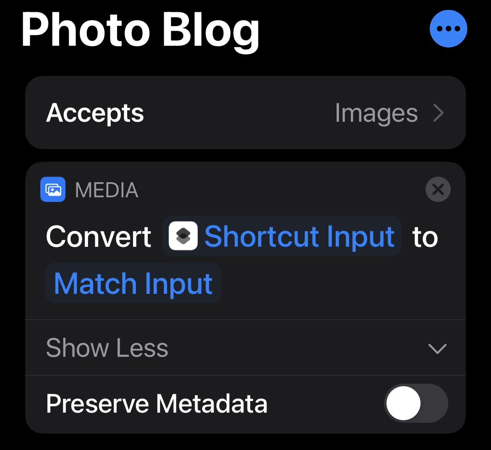
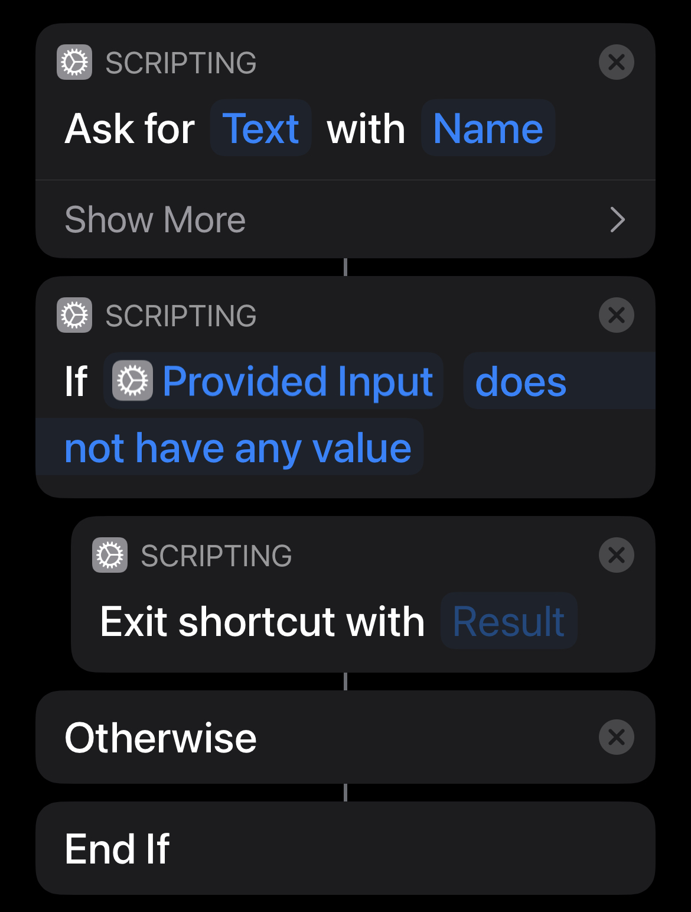
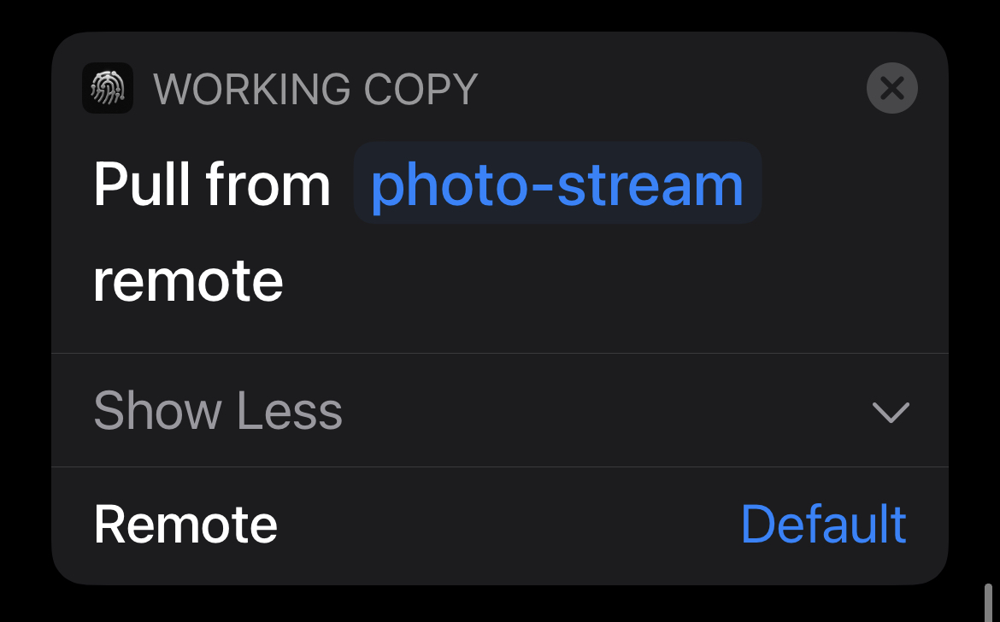
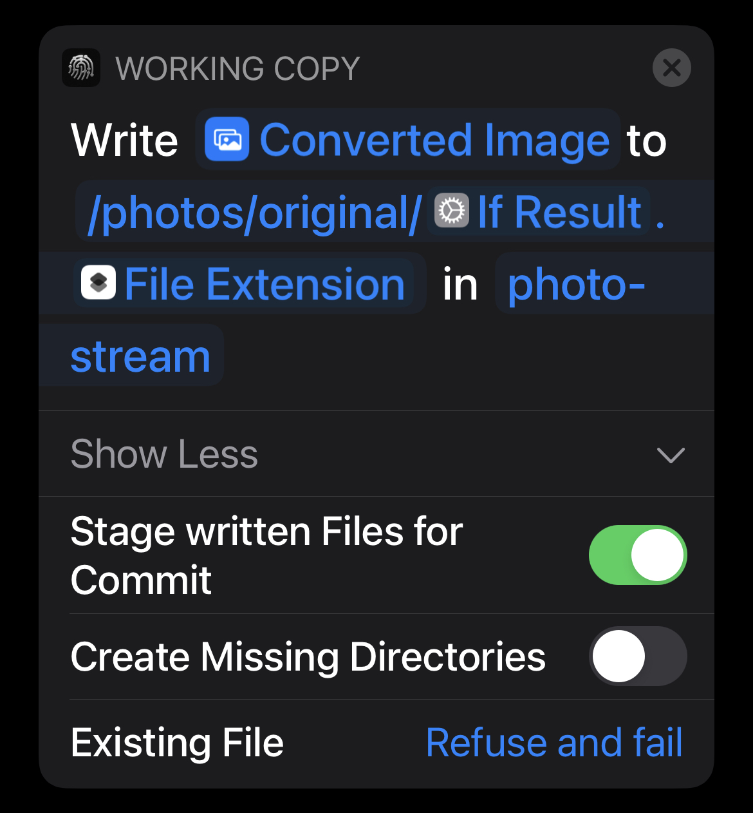
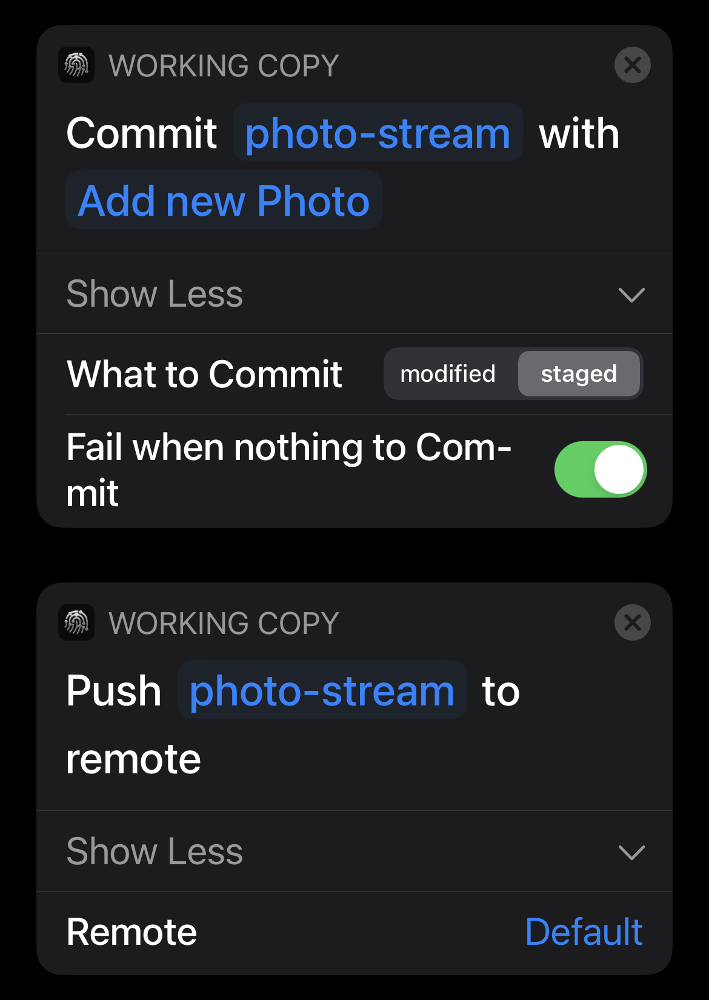
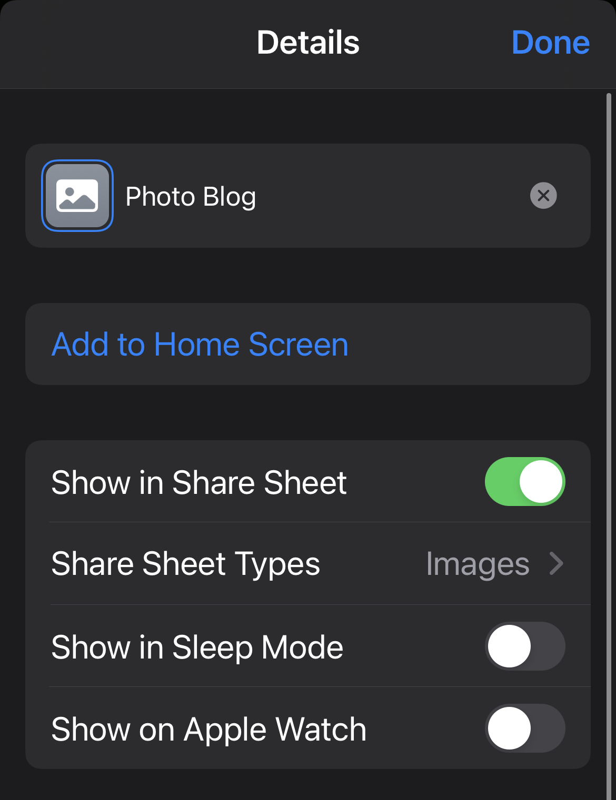
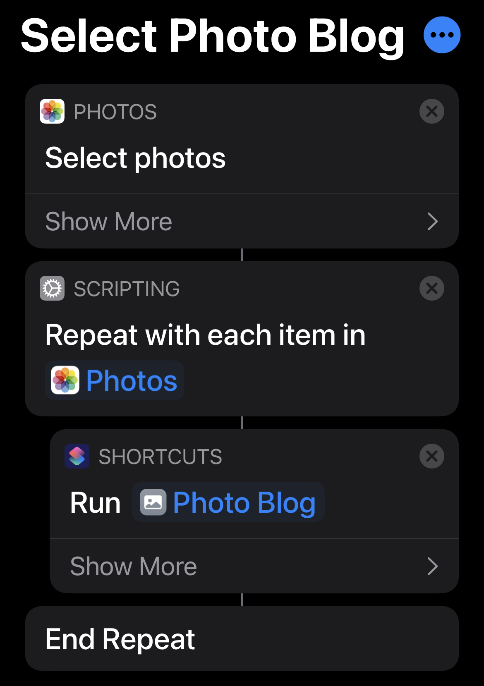
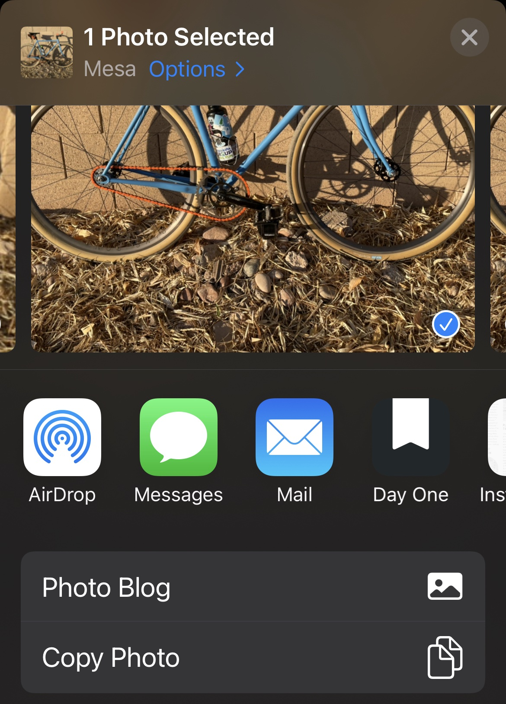

> #### TL;DR
>
> Using [Working Copy][working-copy] and this [iOS Shortcut][shortcut], I take and edit photos on my phone and post them to my [Photo Blog][my-photo-stream] hosted on [Netlify](netlify). See [the instructions at the end of this post](#putting-it-all-together) for how to set this up for yourself.

One of my guiding principles for personal projects is that they should all deploy via `git push`. This helps keep things portable and ensures that I can deploy projects from a variety of devices.

Last year, I (re)downloaded [VSCO][vsco] for the first time in awhile and was really enjoying it for editing photos on my phone. I liked that it was a pretty quick and enjoyable activity (the opposite of my other phone activity: doomscrolling) that I could pick up and put down at anytime, even saving partially edited drafts for later.

Around that same time I also found [`photo-stream`][photo-stream-og], a simple photo blog built by [Tim Van Damme](https://github.com/maxvoltar). It uses `jekyll` to generate static files, so it is deployable almost anywhere, but it includes a cache plugin to make builds faster on Netlify, which was already my hosting provider of choice.

I was able to edit pictures on my phone, save them to my iCloud Photo Library, and then push them to GitHub from my computer. This all worked pretty well, but one of the things I enjoyed most about editing photos was that I didn't have to be at my computer. So posting the photos on my computer often felt like a chore or something I would forget to do entirely.

## Working Copy + Shortcuts

Since everything was deployable via `git push`, it was the perfect use for [Working Copy][working-copy] which is an amazing git client for iOS. But in that power comes a somewhat complicated series of steps for importing, naming, and staging/committing/pushing the files.

But my favorite part of the app is that it supports iOS Shortcuts, which means all those steps can be automated. Below is a step-by-step explanation of the shortcut I created and what it does. If you're familiar with iOS Shortcuts, this all might look familiar. But I wanted to walk-through each step of the shortcut as I learned a lot about some of the specific things iOS Shortcuts and the Working Copy actions make possible.

## The Shortcut

The first step is to tell the shortcut that it can accept any image, and to process that image in some way. In this case, we are not converting it to a different file type because it is already passed in as a JPEG. But the most important bit is to uncheck "Preserve Metadata". This will strip out all EXIF data like GPS location. You could also choose not to uncheck this option if you wanted to use that metadata from the image as part of the site, but I saw it as a privacy risk so I opted to strip all that out.

Then the shortcut prompts for some text that will get used as the name of the image. It then makes sure it's not blank and if it is, exits the shortcut early.

Next, we start with one of Working Copy's provided shortcut actions. This will pull the latest from the default origin for the provided repo. If your repo has a different name, you'll want to tap on "photo-stream" and select your repo from the list. I think you'll need to clone it first in Working Copy before it will show up in that list.

The next step uses another Working Copy action to write the converted image to the repo at the specified location with the text from the previous step as the filename. It will also stage the file. And most importantly, the whole process will fail if a file with the same name already exists. I take a lot of pictures of the same mountains and trails, so this is helpful if I end up taking a "Snow on Four Peaks" photo every year. 😅

The last steps are to commit anything that is staged and push it to the default remote. This will kick off a build on Netlify!

To make this shortcut more useful, if you click the details button in the top right corner, you can check the option to "Show in Share Sheet" and set the "Share Sheet Types" to "Images". This will make it so that whenever you open the iOS Share Sheet for an image, one of your options will be "Photo Blog". My usual workflow is to use VSCO to save my edited photo back to my library (so I have a backup of it outside of VSCO) and then use the share sheet from Photos to post it to the blog. But as long as you have a photo on your phone, you should be able to post it with this shortcut.

## Shortcuts Composition

One of my favorite parts about Shortcuts is that you can compose them. So you can now use the shortcut above inside of any other shortcut that processes images. Here's an example where another shortcut is responsible for selecting multiple photos from my library, and each selected photo will be sent to the Photo Blog shortcut as its input.

## Putting it All Together

If you're interested in setting this up for yourself, here are the steps to follow:

- Follow the instructions in the original [`photo-stream` repo](https://github.com/maxvoltar/photo-stream#the-easy-way) to fork and deploy your forked version to Netlify (or somewhere else). Make sure wherever it is hosted allows you to trigger new builds via git.
- Download [Working Copy][working-copy] and [clone](https://workingcopyapp.com/manual/cloning-repos) your forked repo
- Install [this shortcut][shortcut] (it will prompt you to download the Shortcuts app if you don't already have it)
- Open an image in your photo library, tap the share button and tap "Photo Blog"
- Your new photo is on it's way to your blog! For me this process usually takes 60-90 seconds before the photo is live on my site.

[vsco]: https://vsco.co
[working-copy]: https://workingcopyapp.com
[shortcut]: https://www.icloud.com/shortcuts/a9b862fb3412442b965539b0312a3603
[netlify]: https://www.netlify.com
[my-photo-stream]: https://photos.lukelov.es
[photo-stream-og]: https://github.com/maxvoltar/photo-stream
